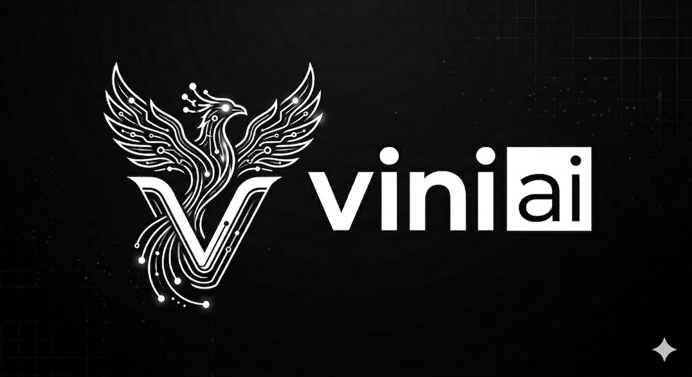
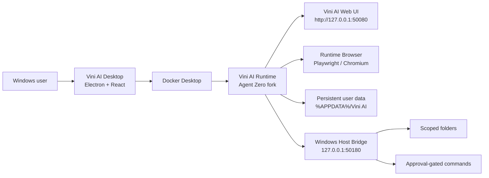

<p align="center">
  
</p>

# Vini AI

[](#quick-start)
[](runtime/Dockerfile.vini-ai)
[](apps/desktop)
[](runtime/agent-zero)
[](apps/desktop)
[](.github/workflows/ci.yml)

Vini AI is a Windows desktop AI agent workspace built around a real local runtime. It rebrands and extends the Agent Zero runtime into a Vini AI product experience with a desktop shell, live browser/desktop surfaces, provider configuration, local data persistence, connectors, voice work, and a scoped Windows host bridge.

The goal is simple: keep the agent runtime real, observable, and useful. No fake readiness states, no mock dashboards, and no hardcoded provider success.

> Screenshots and demo GIFs will live in `docs/assets/`. Add the latest product captures there when the UI stabilizes.

## What Vini AI Is

- A Windows desktop app for running a local AI agent runtime.
- A Vini AI branded fork of Agent Zero under `runtime/agent-zero`.
- A real Docker-backed runtime served at `http://127.0.0.1:50080`.
- A desktop shell that can start, stop, monitor, and open the runtime.
- A Manus-inspired agent workspace with chat, computer, browser, desktop, builder, connectors, and voice surfaces.
- A local-first product that keeps runtime data outside tracked source.

## Highlights

| Area | Status | Details |
| --- | --- | --- |
| Desktop shell | In progress | Electron, Vite, React, Windows packaging path |
| Runtime | Working baseline | Docker image built from `runtime/Dockerfile.vini-ai` |
| Vini AI UI | In progress | Rebranded Agent Zero UI with Vini AI workspace styling |
| Vini AI Computer | In progress | Browser, desktop, editor/build surfaces inside the runtime UI |
| Host bridge | In progress | Scoped Windows folder access, file operations, command approval gates |
| Connectors | In progress | Connector UI and direct setup flows are being added |
| Voice mode | Experimental | VAD, STT, TTS, and low-latency model routing are under active iteration |
| Packaging | Planned | Windows installer path exists; production release hardening remains |

## Architecture



Vini AI keeps a clear boundary between product code and runtime code:

- `apps/desktop` contains the Windows desktop shell.
- `runtime/agent-zero` contains the rebranded runtime fork.
- `runtime/Dockerfile.vini-ai` builds the local runtime image.
- `docs` contains setup, architecture, verification, attribution, and host bridge notes.

See [docs/architecture.md](docs/architecture.md) for the deeper system contract.

## Product Preview

Add these assets when ready:

| Surface | Asset path |
| --- | --- |
| Main workspace | `docs/assets/vini-ai-workspace.png` |
| Vini AI Computer | `docs/assets/vini-ai-computer.png` |
| Browser task | `docs/assets/vini-ai-browser.gif` |
| Connectors | `docs/assets/vini-ai-connectors.png` |
| Voice mode | `docs/assets/vini-ai-voice.gif` |

## Repository Layout

```text
.
|-- apps/
|   `-- desktop/              # Electron + Vite + React desktop shell
|-- docs/                     # Architecture, setup, verification, attribution
|-- runtime/
|   |-- Dockerfile.vini-ai    # Local Vini AI runtime image
|   |-- entrypoint-overrides/ # Runtime entrypoint overrides
|   `-- agent-zero/           # Rebranded Agent Zero runtime fork
|-- AGENTS.md                 # Project instructions for agents
|-- package.json              # Workspace scripts
`-- README.md
```

## Quick Start

### Prerequisites

- Windows 10 or Windows 11
- Docker Desktop running
- Node.js 24+
- Git

### Install Desktop Dependencies

```powershell
npm --prefix apps/desktop install
```

### Run Desktop App In Development

```powershell
npm run desktop:dev
```

### Build The Runtime Image

```powershell
docker build -f runtime\Dockerfile.vini-ai -t vini-ai/agent-runtime:local runtime
```

### Run The Runtime Directly

```powershell
docker run -d --name vini-ai-agent-zero --restart unless-stopped -p 50080:80 -v "$env:APPDATA\Vini AI\agent-zero\usr:/a0/usr" vini-ai/agent-runtime:local
```

Open:

```text
http://127.0.0.1:50080
```

The desktop app is the preferred path because it performs real local checks and starts the runtime with the intended Vini AI settings.

## Core Principles

Vini AI should be built like a real product, not a demo.

- Runtime actions must reflect real Docker, HTTP, filesystem, browser, and provider state.
- Provider/model setup must be honest when keys or accounts are missing.
- Runtime data should live in the user data directory, not tracked source.
- Dangerous host operations must be scoped and approval-gated.
- Upstream Agent Zero license and attribution must remain preserved.
- UI polish should not break the underlying runtime behavior.

## Tech Stack

| Layer | Technology |
| --- | --- |
| Desktop shell | Electron, Vite, React, TypeScript |
| Runtime | Python, Flask, Agent Zero lineage |
| Runtime container | Docker |
| Browser automation | Playwright / Chromium inside runtime |
| Desktop surface | Agent Zero desktop/browser runtime surfaces |
| Voice work | VAD, STT, TTS pipeline experiments |
| Local bridge | Electron main process, loopback HTTP bridge, scoped filesystem access |
| Packaging | electron-builder, NSIS target |

## Desktop Scripts

```powershell
npm run desktop:dev       # Run Vini AI desktop in development
npm run desktop:build     # Build desktop app
npm run desktop:package   # Build Windows installer
```

## Runtime Contract

| Item | Value |
| --- | --- |
| Runtime URL | `http://127.0.0.1:50080` |
| Container name | `vini-ai-agent-zero` |
| Image name | `vini-ai/agent-runtime:local` |
| Container web port | `80` |
| Host web port | `50080` |
| Runtime data mount | `%APPDATA%/Vini AI/agent-zero/usr` to `/a0/usr` |
| Host bridge | `http://host.docker.internal:50180` inside Docker |

## Windows Host Bridge

Vini AI includes a local host bridge design for carefully scoped host access:

- List scoped folders.
- Read text files inside approved scopes.
- Write, delete, create folders, and run commands only after visible approval.
- Return explicit setup errors when the bridge is not available.

See [docs/windows-host-bridge.md](docs/windows-host-bridge.md).

## Verification

Use the verification checklist before treating a change as ready:

- Docker Desktop is running.
- Runtime image builds successfully.
- Container starts and serves `http://127.0.0.1:50080`.
- Vini AI desktop detects Docker/container/runtime state correctly.
- Provider setup shows real missing-key or missing-account errors.
- Browser and desktop surfaces show live runtime state.
- Persistent data survives app restart.
- Windows installer builds before release.

See [docs/verification.md](docs/verification.md).

## More Docs

- [Roadmap](ROADMAP.md)
- [Contributing](CONTRIBUTING.md)
- [Security](SECURITY.md)
- [Changelog](CHANGELOG.md)
- [Pitch](docs/pitch.md)
- [Technical report](docs/technical-report.md)
- [Manus parity gaps](docs/manus-parity-gaps.md)
- [Release checklist](docs/release-checklist.md)
- [Architecture diagrams](docs/diagrams.md)

## Roadmap

### Phase 1: Runnable Product Baseline

- Keep runtime buildable and runnable from Docker.
- Keep desktop shell connected to real runtime state.
- Finish clean Vini AI rebrand without losing attribution.

### Phase 2: Manus-Style Workspace

- Improve chat/composer polish.
- Tighten Vini AI Computer resizing and live browser visibility.
- Make task progress and proof-of-work clearer.
- Improve browser search so visited pages are visible, not just summarized.

### Phase 3: Real Integrations

- Harden connector setup flows.
- Add API-key based connectors where OAuth is not viable.
- Add browser-based permission flows where supported.
- Surface honest blockers for OAuth providers that reject embedded browsers.

### Phase 4: Voice And Local Control

- Stabilize low-latency speech-to-speech mode.
- Keep STT/TTS models warm where possible.
- Add fast voice model selection separate from default chat model.
- Harden Windows host bridge approvals and audit logs.

### Phase 5: Release

- Build signed Windows installer.
- Add release notes and upgrade path.
- Verify uninstall keeps user data unless explicitly removed.
- Publish clean setup documentation.

## Attribution

Vini AI is built from and extends Agent Zero. Upstream license and attribution files must remain intact.

See [docs/attribution.md](docs/attribution.md).

## License

This repository includes upstream Agent Zero code and license notices. Review the included license and attribution files before redistribution.
