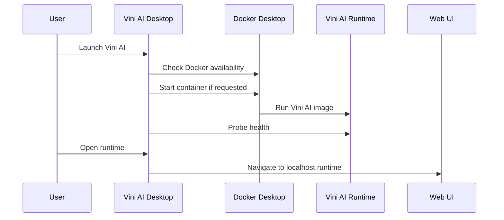
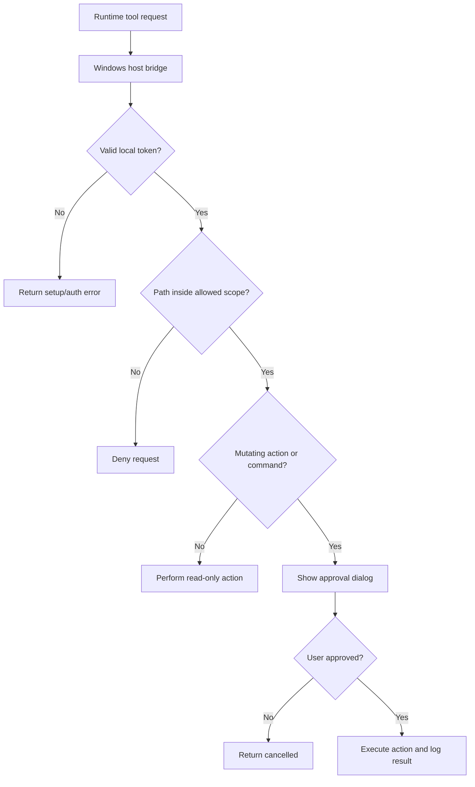
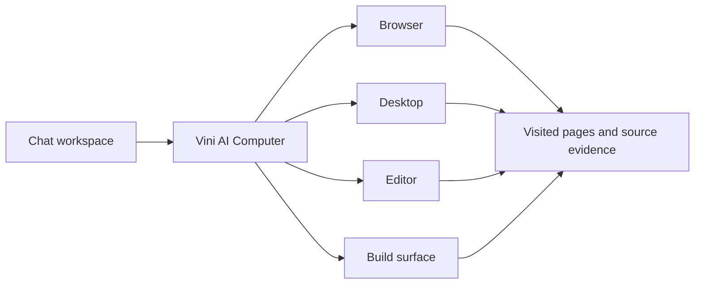
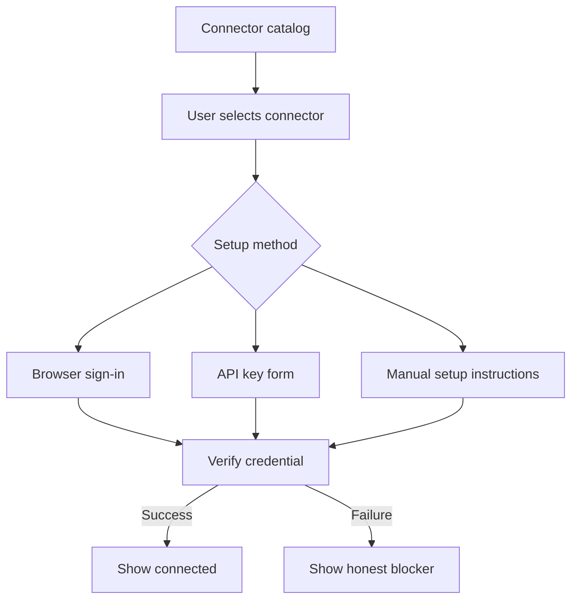

# Vini AI Architecture Diagrams

## Desktop To Runtime

```mermaid
sequenceDiagram
    participant User
    participant Desktop as Vini AI Desktop
    participant Docker as Docker Desktop
    participant Runtime as Vini AI Runtime
    participant UI as Web UI

    User->>Desktop: Launch Vini AI
    Desktop->>Docker: Check Docker availability
    Desktop->>Docker: Start container if requested
    Docker->>Runtime: Run Vini AI image
    Desktop->>Runtime: Probe health
    User->>Desktop: Open runtime
    Desktop->>UI: Navigate to localhost runtime
```

## Host Bridge Approval Flow

```mermaid
flowchart TD
    Runtime["Runtime tool request"] --> Bridge["Windows host bridge"]
    Bridge --> Auth{"Valid local token?"}
    Auth -- No --> Reject["Return setup/auth error"]
    Auth -- Yes --> Scope{"Path inside allowed scope?"}
    Scope -- No --> Deny["Deny request"]
    Scope -- Yes --> Mutating{"Mutating action or command?"}
    Mutating -- No --> Read["Perform read-only action"]
    Mutating -- Yes --> Approval["Show approval dialog"]
    Approval --> Decision{"User approved?"}
    Decision -- No --> Cancel["Return cancelled"]
    Decision -- Yes --> Execute["Execute action and log result"]
```

## Vini AI Computer

```mermaid
flowchart LR
    Chat["Chat workspace"] --> Computer["Vini AI Computer"]
    Computer --> Browser["Browser"]
    Computer --> Desktop["Desktop"]
    Computer --> Editor["Editor"]
    Computer --> Builder["Build surface"]
    Browser --> Evidence["Visited pages and source evidence"]
    Desktop --> Evidence
    Editor --> Evidence
    Builder --> Evidence
```

## Connector Setup

```mermaid
flowchart TD
    Catalog["Connector catalog"] --> Select["User selects connector"]
    Select --> Method{"Setup method"}
    Method --> OAuth["Browser sign-in"]
    Method --> ApiKey["API key form"]
    Method --> Manual["Manual setup instructions"]
    OAuth --> Verify["Verify real session/token"]
    ApiKey --> Verify["Verify credential"]
    Manual --> Verify
    Verify -- Success --> Connected["Show connected"]
    Verify -- Failure --> Blocker["Show honest blocker"]
```
