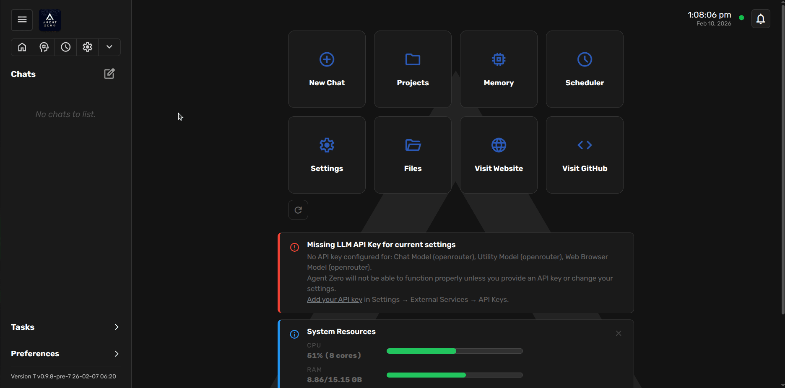
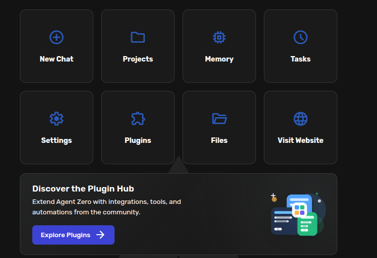
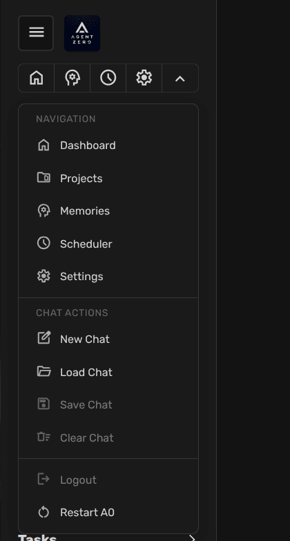
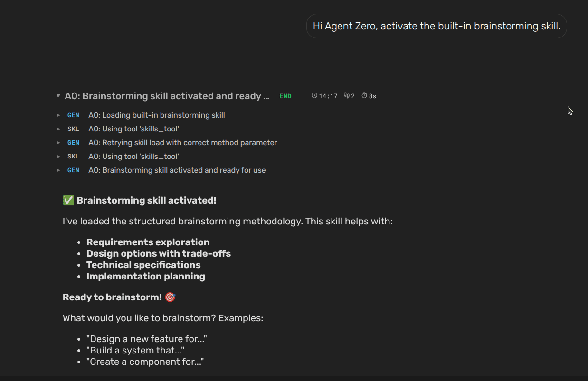

# Quick Start

This guide gets you from install to a first useful chat. Keep it simple: start
Vini AI, add a model or API key, open the Web UI, and give it a concrete job.

## Installation (recommended)

Run one command; the script handles Docker, image pull, and container setup.

**macOS / Linux:**
```bash
curl -fsSL https://bash.agent-zero.ai | bash
```

**Windows (PowerShell):**
```powershell
irm https://ps.agent-zero.ai | iex
```

Follow the CLI prompts for port and authentication, complete onboarding, then open the Web UI URL from the terminal.

> [!TIP]
> To update later, open **Settings UI -> Update tab -> Open Self Update** (see [How to Update](setup/installation.md#how-to-update-agent-zero)). Backups are automatically managed internally.

> [!NOTE]
> For manual Docker Desktop setup, volume mapping, and platform-specific detail, see the [Installation Guide](setup/installation.md#manual-installation-advanced).

## Use Vini AI on your real local files

If you want Vini AI to work on the actual files on your computer, this is the important part.

Vini AI stays in Docker for safety. The A0 CLI installs and runs on your host machine. It is not another CLI agent; it is the connector that lets your running Vini AI instance work on the real files on your real computer.

**macOS / Linux:**
```bash
curl -LsSf https://cli.agent-zero.ai/install.sh | sh
```

**Windows (PowerShell):**
```powershell
irm https://cli.agent-zero.ai/install.ps1 | iex
```

Run those on the host machine, not inside the Vini AI container.

Then launch:

```bash
a0
```

Once `a0` connects, open or create a chat there. The reasoning still belongs to Vini AI; the CLI is the host bridge that lets it work on real local files on your machine.

For the full setup flow, host picker screenshots, command palette guidance, Browser mode commands, manual fallback install paths, remote-host tips, and a copy-ready brief for another agent, see the [A0 CLI Connector guide](guides/a0-cli-connector.md).

### Open the Web UI and complete onboarding

Open your browser and navigate to `http://localhost:<PORT>`. The Web UI will
show the onboarding banner. Click **Start Onboarding** to choose Cloud or
Local, add a provider key or account connection, and select your main and
utility models.



For a screenshot walkthrough using **Vini AI API** with
`claude-opus-4-6`, see the [First-Run Onboarding guide](guides/onboarding.md).

> [!NOTE]
> Vini AI supports hosted providers and local models. You can use the same
> provider for main and utility work, or choose separate providers for each.

### Start your first chat

Once configured, you will see the Vini AI dashboard.



Click **New Chat** and start with a specific request.

Good first prompts:

```text
Create a short plan for organizing my project notes.
```

```text
Use the Browser to research three options for this tool and summarize the tradeoffs.
```

```text
Help me create a project for this repository and write good instructions for it.
```

> [!TIP]
> The Web UI provides a comprehensive chat actions dropdown with options for managing conversations, including creating new chats, resetting, saving/loading, and many more advanced features. Chats are saved in JSON format in the `/usr/chats` directory.
>
> 

---

## Example Interaction

Try a small request first so you can see how Vini AI thinks, uses tools, and
reports progress.

1. Type a concrete request in the chat input and press Enter.
2. Watch the streamed response and any tool calls.
3. Redirect the agent if it starts moving in the wrong direction.
4. Ask for the final result in the format you want.

Here's an example of what you might see in the Web UI at step 3:



## Next Steps
Now that you've run a simple task, you can experiment with more complex requests. Try asking Vini AI to:

- Create a project for a focused workspace.
- Use the built-in Browser to research, screenshot, or annotate a page.
- Open the Desktop when you want Linux GUI apps or LibreOffice Cowork.
- Review Memory when Vini AI seems to keep the wrong assumption.
- Connect A0 CLI when Vini AI should work on host-machine files.
- Use **+ -> Skills** when you want to pin or remove a skill in the current chat.
- Switch Agent Profiles from the menu near the chat input when you want a different working style.
- Use the first model dropdown when you want to choose or edit Model Presets.
- Attach files and ask for a summary, edit, or conversion.
- Create a scheduled task for recurring work.
- Explore plugins when you need installed integrations or custom UI features.

### [Open A0 Browser Guide](guides/browser.md)

Explains the built-in Browser, live Browser Canvas, screenshots, annotations, host-browser mode through A0 CLI, and Chrome extensions.

### [Open A0 Desktop Guide](guides/desktop.md)

Shows the right-side Canvas Linux desktop, the New menu for Markdown/Writer/Spreadsheet/Presentation files, and LibreOffice Cowork.

### [Open A0 Memory Guide](guides/memory.md)

Explains how to search, edit, delete, export, and curate memories before stale context starts steering the agent.

### [Open A0 Skills Guide](guides/skills.md)

Shows the chat input **+** menu, the Skills selector, and how active skills are added to prompt extras.

### [Open A0 Agent Profiles Guide](guides/agent-profiles.md)

Shows how to switch profiles in a chat and start the guided profile-creation flow.

### [Open A0 Model Presets Guide](guides/model-presets.md)

Explains presets as simple named shortcuts for model setups.

### [Open A0 Usage Guide](guides/usage.md)

Provides more in-depth information on chat controls, tools, projects, tasks, and backup/restore.

## Video Tutorials
- [MCP Server Setup](https://youtu.be/pM5f4Vz3_IQ)
- [Projects & Workspaces](https://youtu.be/RrTDp_v9V1c)
- [Memory Management](https://youtu.be/sizjAq2-d9s)
